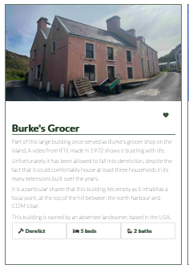

# **_NOHOME.ie_**

NOHOME.ie is a simple parody property-listings site set up to create further awareness of the issue of vacant housing in Ireland. The title echos another popular property listings site in Ireland, *myhome.ie*. 
The listings on MYHOME.ie include only vacant and derelict properties on the island of Cape Clear, properties that are being held onto by owners instead of rented or sold. 

MYHOME.ie is part of a campaign/mission to document as many vacant and derelict houses in Ireland, starting with the microcosm of the issue identified on the island of Cape Clear. It is the hope that this may encourage the owners of these properties to put them back into use. 
The site is aimed at anyone with an interest in the housing crisis in Ireland, a pressing topic at present. 

Welcome to the campaign <a href="https://brionico.github.io/m_project1/" target="_blank" rel="noopener">NOHOME.ie</a>

# Contents

* [**User Experience UX**](<#user-experience-ux>)
    *  [User Stories](<#user-stories>)
    * [Wireframes](<#wireframes>)
    * [Site Structure](<#site-structure>)
    * [Design Choices](<#design-choices>)
    *  [Typography](<#typography>)
    *  [Colour Scheme](<#colour-scheme>)
* [**Features**](<#features>)
    * [**Home**](<#navigation-menu>)
         * [Navigation menu](<#navigation-menu>)
         * [Introduction](<#introduction>)
         * [Listings](<#gallery>)
         * [About](<#about>)
         * [Welcome text](<#welcome-text>)
         * [Footer](<#footer>)
         * [Record form](<#record-form>)
         * [Thank you](<#thank-you>)
    * [**Future Features**](<#future-features>)
* [**Technologies Used**](<#technologies-used>)
* [**Known Bugs**](<#known-bugs>)
* [**Testing**](<#testing>)
* [**Deployment**](<#deployment>)
* [**Credits**](<#credits>)
    * [**Content**](<#content>)
    * [**Media**](<#media>)
*  [**Acknowledgements**](<#acknowledgements>)

# User Experience (UX)

## User Stories

* As a user I want to be able to navigate seamlessly throughout the site. 
* As a user I want to understand what the purpose of the site is as soon as I load it. 
* As a user I want to be able to contact the campaign managers for more information. 
* As a user I want to be presented with content that interests me.
* As a user I want to know more about the campaign.
* As a user I want to be able to connect with NOHOME on social media if I so wish. 
* As a user I want to get involved with the campaign.
* As a user I want to join a mailing list to stay up-to-date with any progress. 

* As a return user I want to see that new property lisings content and features are added reguarly. 

[Back to top](<#contents>)

## Wireframes

The wireframes for NOHOME.ie were produced in [Figma](https://figma.com). 
There are wireframes for a full width display/ desktop display. 
Please note that the final site varies slightly from the wireframes. As the learning process developed, so too did the look of the site.

[Back to top](<#contents>)

## Site Structure

NOHOME.ie website has three pages. The [Home page](index.html) is the default loading page, the [Listings](listings.html) and [About](about.html) pages are all accessible primarily from the navigation menu. 
The *Record* button on the homepage also takes you to the form on the *About* page. 

The *here* in *Click here to view the house you'll never have* takes the user to the Listings page. 

*Home* is linked from the logo on every page. 

[Back to top](<#contents>)

## Design Choices

* ### Typography
* The fonts chosen were 'Roboto for the headings and 'Lato' for the body text. They both have a fall-back of sans-serif set in case the user's browser does not support Google fonts. 
*  'Roboto' was chosen for the headings as it has a little more imact than the 'Lato' font.  For this reason it made the headings and the logo stand out and gave them added presence. 
* Lato was chosen as it is quite close to the type of font typically seen in property listings sites. It has a casual and welcoming feel. 
The two fonts compliment each other well.
 

* ### Colour Scheme
* The site itself is understated and simple and for this reason, aside from the images, there is an absence of any dominating colour scheme. Instead the site rotates around a subdued palette of white and grey shot with flashes of forest green that pull out and accentuate the greens in the images. 

* The colour used most predominantly throughout the site was a dark green rgb colour *rgb(40, 61, 38)*. It was used with varying degrees of transparency.  This colour was chosen both because of how it brought out the subtle greens in the images as well as how it brings to mind the mossy greens and earthy hues associated with houses that have fallen into dereliction. 
The green was paired with greys and blacks and sometimes a soft brown-black shade, *#251919*. 

* To avoid the use of additional colours that would compete with the images, a shadow effect was used to separate the navigation bar from the rest of the page and the footer from the rest of the page:

[Back to top](<#contents>)

# Features

NOHOME.ie is set up to be welcoming and easy to navigate. 
The images are of the utmost importance as they most effectively convey the purpose of the site, which is to draw attention to the problem of dereliction and vacant housing in Ireland. 

This is not a showy site- the aim was for the content and the images to speak for themselves and communicate the main thrust of the site. 

Nestled within the site are some features that the user is likely to be familiar with, such as a navigation bar, a submission form and a search bar with a drop-down selector. 
 
The overall feel of the website is intended to be hard-hitting and serious but with an inviting leaning. The intention is to clearly communicate the mission and encourage the user to explore further, learn more and possibly contribute to the campaign.  

## Existing Features  
  * ### Navigation Menu

    * The navigation bar is located at the top of all the pages in the site. It is fully responsive and contains links to all the pages of the site. This ensures ease of navigation throughout the site. 
    * The logo is clickable with a link back to the home page for enhanced UX.

[Back to top](<#contents>)

  * ### Introduction

    * Located on the home page over the hero image is text that communicates the mission statement of the campaign. 
    * Beneath the text is a search bar with a drop-down selector that lists the words *no* *one* *is* and *home*. The intention of this is to further enhance the hard-hitting element of the campaign. 
    * The placeholder message on the search bar tells the user to "Search for your (in) Dream(s) Home".
    * There is also a link to the listings page embedded in the text:

[Back to top](<#contents>)

  * ### Listings
    * The *Listings* section is the backbone of the site. It is where the images and accompanying information about featured vacant and derelict homes are listed.  
    * Each image box has an added zoom effect to add interest and movement to the listings. 
    * The heart icon on the top right corner of each listing is reminiscent of the property listings sites many are familiar with. 
    * The listings boxes copy the format that property listings usually take, except none of these properties are for sale- they are all vacant and/or derelict. Instead, each listing has a bit of a back-story and context. 

    
    

    * An iframes of a Google Maps link gives the user added perspective and a sense of place:

[Back to top](<#contents>)

  * ### About
    The *About* section reiterates for the user what the aim of the NOHOME.ie campaign is. 
    * The hero image of a door surrounded by overgrown foliage once again communicates the issue of dereliction and waste. The image is enhanced with a subtle zoom effect. The intention is to draw the user towards the door and pique interest. 
    * There is a large button with an embedded link to the *Record a Vacant Home* form on the same page, once again encourging the user to contribte to the campaign. The button flickers to transparent when it is hovered over, allowing the image below to bleed through. 

[Back to top](<#contents>)

  * ### Welcome text

    * This information section provides further context to the user about the campaign. It details the motivations for its creation as well as the aims and intentions. 
    * The information piece is styled in a simple flex box with a subtle green border. Some icons are included for visual interest. 
    * This information section will change as the campaign grows and the scope of it spreads nationwide.

[Back to top](<#contents>)

* ### Footer
    
    * Contains social media links. To enhance the UX the links open in other tabs.
    * The social media presence will help the user with their research into the NOHOME.ie campaign and will also encourage them to contribute to and involve themselves with the mission.
    * Note that the decision has been made to exclude any links to *Twitter*. It is the developers opinion that this site is rapidly falling out of favour since becoming an unregulated platform and it would not be in good taste to include a link to such a site. A link to Mastodon has been included as a reasonable alternative.   
    * The decision was made to include the social media images on the footer rather than on the header as it is accepted practice that for sites that update social media content less reguarly, (which will be the case with NOHOME.ie until it is established further), the social media links should be located here. 
    * The footer also contains contact information for the campaign in the way of an email address that invites the user to sign up to a mailing list. 

[Back to top](<#contents>)

* ### Record a Vacant Home Form
 * This form is styled in a simple green with text inputs, a text area for an address, radio inputs and a submit button. 
 It allows the user to contribute to the campaign. The aim is for it to become a valuable tool in creating a nationwide vacant home database complete with stories of the history of each home. 

[Back to top](<#contents>)

* ### Thank You/Form Redirection

 - When the form is submitted, the user is taken to a simple html page that states simply Thank you for your submission! 

 - There is an embedded link beneath this message through which the user can navigate back to *Home*.
 - The link to this thank you page is set as target=_blank so that the thank you page opens in another tab. 

[Back to top](<#contents>)

## Future Features 

* A future feature that the developer would like to include in the site is an interactive map in which vacant properties can be pinned into locations. It would provide a dramatic visual diagram of how prevalent the issue of vacant and derelict housing is in Ireland. 
* In the future, it would be valuable to include a blog section as well as a section for video updates, perhaps in the manner of an iframe of the instagram page to contain reels and stories. 
* Another future feature would be further styling of the button on the homepage as well as the text boxes. Time was the preventative factor here.
* If there was more time, more styling would be added to the thank-you page after submission. 
* It was outside of the scope of this project but another future feature that would be added is for the search bar to return messages to the user that reinforce the thrust of the campaign. The search would return messages that wouold reinforce the thrust of the campaign such as:
"There are no homes available in your area, but plenty of vacant houses, if this makes you angry- join our campaign." etc

[Back to top](<#contents>)

# Technologies Used
* [HTML5](https://html.spec.whatwg.org/) - provides the content and structure for the website.
* [CSS](https://www.w3.org/Style/CSS/Overview.en.html) - provides the styling.
* [Figma](https://balsamiq.com/wireframes/) - used to create the wireframes.
* [Gitpod](https://www.gitpod.io/#get-started) - used to deploy the website.
* [Github](https://github.com/) - used to host and edit the website.
* [Diffchecker](https://www.diffchecker.com/)- used to check for errors in code that was copied and pasted between the pages in the site.
* [Responsive Design Checker](https://responsivedesignchecker.com/)- used to ensure site was responsive on all devices.
* [HTML validator](https://validator.w3.org/)- used to check for HTML syntax issues.
* [CSS3 validator](https://jigsaw.w3.org/css-validator/)- used to check for CSS3 syntax issues.
* [Google Chrome DevTools](https://developer.chrome.com/docs/devtools/) was used manually as well as to engage an audit using lighthouse. 

[Back to top](<#contents>)

# Known Bugs
1. When the site is displayed on the smallest screen sizes, ie screens under circa 450px width, the menu items on the navigation menu are displayed beginning with *About* instead of showing *Home* at the top of the list, which woulld be considered better UX. Time was the preventative factor in amending this issue:

2. In addition to this, the home icon separates from the NOHOME.ie part of the logo at around 350px and lower widths. This is also not ideal aesthetically. This is something that could also be amended in the future, perhaps by developing a unique logo instead of using Google font in conjunction with fontawesome icons. 
3. For screen sizes under circa 450px in width, the gap between the *Record* button and the footer is too large. This issue, and the one above, likely could have been avoided if this section was created using flexbox settings. This is how it would be approached in future. 

# Resolved Bugs

1. There was a problem with the footer and above section disappearing behind the hero-image section on the home page.-it was resolved with help from tutor support. It was a position:absolute issue. The hero image was set to position: absolute as was the section.

2. Amiresponsive was showing that the last section on the Homepage was bleeding into the footer. This was caused by double inputs for footer values. It was easily resolved. 

3. The last section on the homepage was bleeding over the border when viewed on a smaller screen size. A lot of attempts were made to adjust this using media queries to no avail. The solution was to use flexbox. 

4. The *Record* button on the About page was not centering. The height of the div needed to be changed to 100%. 

4. Images were not loading in other user's browsers. The paths were wrong. This issue was resolved when a forward slash (/) was dropped from the beginning of the path. 

# Testing

### Testing User Stories from User Experience (UX) Section

-   #### Visitor Goals
    
    1. As a user I want to be able to navigate seamlessly throughout the site. 
        
       -  Upon entering the site, users are automatically greeted with a clean and easily readable navigation bar to go to the page of their choice. Underneath there is a Hero Image with Text that contains an embedded link and a "Search Properties" Call to action button.
       - The user has three options, navigate to the *Listings* or *About* sections using the menu on the navigation bar,click on the embedded link in the hero image text that will bring them to the *Listings* page, or scroll down to understand the campaign more and click on the button link that will bring them to the form on the *About* page. 

    2. As a user I want to understand what the purpose of the site is as soon as I load it. 
    
       - The purpose of the site is immediately clear as we are presented with an image that effectively portrays the theme of dereliction and vacant housing in an Irish content. The image is very obviously of an Irish farmhouse left to fall into dereliction. In the social context of the housing emergency, the point being made is clear. 
       - The text over the hero image further establishes the mission statement of the campaign. 
       - The search bar is something that is almost always seen on the welcome page of property listings sites such as daft.ie and myhome.ie etc and so it is clear that the intent is to parody such a site. 
       - In addition to this, the drop down menu contains the message *no, one, is, home*.

    3. As a user I want to be able to contact the campaign managers for more information. 

      - The campaign managers can be contacted via the email address located underneath the social media links in the footer. 
      - In addition to this, the campaign can be contacted via aforementioned social media links in the footer.
      - Further to this, the form on the about page can also be considered a viable method of contacting the campaing organizers. 

    4. As a user I want to be presented with content that interests me.

      - The *Listings* section is presented in such a way that the user is met with an interesting and dynamic image that encourages them to move on. 
      - The information is presented in much the same way as a regular property lisitings site which should pique the user's interest. 
      - The stories contained within the property listings boxes contain local information that the user should find intriguing. 
      - When the user navigates to the *About* page, they are presented with a submission form as a call to action that they may be interested in engaging with.
    
    5. As a user I want to know more about the campaign.

      - The user is presented with two blocks of text describing the campaign on the *Home* page. 
      - The *About* page also further reiterates the mission statement of the campaing. 
      - In addition to this, the social media links are provided which will give the user further context. 

    6. As a user I want to be able to connect with NOHOME on social media if I so wish.  

        - The social media links are placed at the bottom of the page, clearly embedded in the footer. The decision was made not to include them in the header until the campaing was further established. It is better UX to include them in the footer if social media is updated less reguarly.
        - Whichever link they click, it will be open up in a new tab to ensure the user can easily get back to the website.

    7. As a user I want to get involved with the campaign & As a user I want to join a mailing list to stay up-to-date with any progress.  

      - The user is presented with several choices that would satisfy this:
          a. The user can scroll to the footer and join the campaign's social media or use the email address presented there.
          b. The user can navigate to the *About* section by using the menu bar or the imbedded button link on the Homepage which will take them to the form where they can submit information and get involved with the campaign. 

-   #### Returning Visitor Goals
    1. As a return user I want to see that new vacant property listings content and features are added reguarly. 

      - The site is set up in such a way that new property listings would be easily added. 
      - In addition to this, the simple structure allows for the addition of a blog section to be added. 

## Browser Compatibility  

NOHOME.ie was tested on the following browsers with no visible issues for the user. 
Google Chrome, Safari and Mozilla Firefox. Appearance, functionality and responsiveness were consistent throughout a range of device sizes and browsers. 

### Further device testing

|        | iphone 13 | Redmi 8 | iPhone SE | iPad |Kindle Fire HDX | Display <1200px | Display >1200px |
|--------|---------|-----------|----------|------|----------|-----------------|-----------------|
| Render | pass    | pass      | pass     | pass | pass     | pass            | pass            |
| Images | pass    | pass      | pass     | pass | pass     | pass            | pass            |
| Links  | pass    | pass      | pass     | pass | pass     | pass            | pass            |

-   [W3C CSS Validator](https://jigsaw.w3.org/css-validator/#validate_by_input) test performed. The CSS and markup passed the test.
Results:

- [HTML validator](https://validator.w3.org/) was used to check for HTML syntax issues. The test initially failed due to some stray closing tags and incorrectly entered meta data. This issue was resolved and the test was passed. 
Results:

-   Responsive design tests were carried out manually with [Google Chrome DevTools](https://developer.chrome.com/docs/devtools/) and [Responsive Design Checker](https://www.responsivedesignchecker.com/).

- Lighthouse was run in incognito mode from Chrome developer tools and the results are as follows:
Desktop:

Mobile:

[Back to top](<#contents>)

### Further Testing

- The deployed site was shared to the Slack channel for peer review. The only issue commented on was the known bug detailed in *Known bugs* #1. 
-   The Website was tested on Google Chrome, Internet Explorer and Safari browsers.
-   The website was viewed on a variety of devices such as Desktop, Laptop, iPhone13, Redmi 8.
-   A large amount of testing was done to ensure that all pages were linking correctly.
-   Friends and family members were asked to review the site and documentation to point out any bugs and/or user experience issues.
- The site was examined prior to submission by the class group during a weekly stand-up session and found to be fully responsive.

# Deployment

## **To deploy the project**

The site was deployed to GitHub pages. The steps to deploy a site are as follows:

1. It is important to first ensure that you have commited and pushed any recent changes in your gitpod.io workspace, do this first by typing: *git add .* then press *return* in the terminal window, followed by *git commit -m "ADD NOTES HERE"*, press *return* and, finally *git push*. You are now ready to deploy. 
2. Open GitHub and from the menu on the left, choose your repository. 
3. In the GitHub repository, navigate to the **Settings** tab on the top right corner. 

4. Once in Settings, navigate to the **Pages** tab on the left hand side.

5. Scroll to **Source**, select the branch **main**, then click save. 

6. The page should refresh. You may need to manually refresh a few times. As you can see from the image above, your deployed site address should display across a ribbon display. 

**Note**: For my first deployment, I needed to choose a Jekyll theme in order to have my site deployed. Github has instructions for this eventuality : [GitHub](https://docs.github.com/en/pages/setting-up-a-github-pages-site-with-jekyll/adding-a-theme-to-your-github-pages-site-using-jekyll)
 
The live link to the Github repository can be found here - https://brionico.github.io/m_project1/

## **To fork the repository on GitHub**

A copy of the GitHub Repository can be made by forking the GitHub account. This copy can be viewed and changes can be made to the copy without affecting the original repository. These are the steps that should be followed to fork the repository: 

1. Log in to **GitHub** and locate the [repository](https://github.com/BrioniCo/m_project1).
2. On the right hand side of the page inline with the repository name is a button called **'Fork'**, click on the button to create a copy of the original repository in your GitHub Account.

 (Note that this approach was not utilised by the developer for this project due to an initial lack of understanding/reluctance about embarking on the process);

## **To create a local clone of this project**
This is how you clone a project from GitHub:

1. Under the repository’s name, click on the **code** tab.
2. In the **HTTPS** section, under **local** click on the two squares icon to copy the given URL or else use *right-click_copy* or *command* + *C* for Mac, or *Ctrl* + *C* for PC. 

3. Open your terminal in the work space you would like the repository cloned to. 
4. Type **git clone** and then paste the URL you have copied from GitHub.
5. Press *enter* and the local clone will have been created. 

[Back to top](<#contents>)

# Credits
### Content

* The font came from [Google Fonts](https://fonts.google.com/).
* The map is embedded from [Google Maps](https://www.google.com/maps).
* Part of the code for the property listings was taken from a [YouTube tutorial] [#]
* The icons came from [Font Awesome](https://fontawesome.com/).
* [Figma](https://figma.com/wireframes/) was used to create the wireframes.
* The search bar on the main page came from this [Page Dart](https://pagedart.com/blog/how-to-add-a-search-bar-in-html/)
* Much of the coding for the property-listings boxes came from this [YouTube tutorial](https://www.youtube.com/watch?v=khLaYtW5N4s)
*  [StackEdit](https://stackedit.io/).
* [Google Chrome DevTools](https://developer.chrome.com/docs/devtools/)
* [Responsive Design Checker](https://www.responsivedesignchecker.com/)
* The readme used as a guiding template was from Ewan Colquhoun for Wawas woods: [Wawas woods](https://github.com/EwanColquhoun/wawaswoods). In addition, instructions on how to fork a repository were quoted from this readme. 

### Media
* The photos all came from the developer, [Brioni Connolly].
[Back to top](<#contents>)

# Acknowledgements

The site was completed as a Portfolio 1 Project piece for the Full Stack Software Developer (e-Commerce) Diploma at the [Code Institute](https://codeinstitute.net/). 
I would like to thank my mentor [Precious Ijege](https://www.linkedin.com/in/precious-ijege-908a00168/) for his help and guidance. I would also like to thank the Code Institute Slack community for all the invaluable information I found there, the tutorial sessions from student help as well as our Cohort Facilitator Alan Bushnell for the very useful weekly stand-up sessions and general insights, support and information.

In particular I would also like to thank two of my classmates, Carl Murray and Benjamin Riordan who repeatedly took time out of their own studies to help me out with issues I was having. 

At present, NOHOME.ie is a fictional campaign that may be launched some day. The domain name has been purchased just in case!

Brioni Connolly 2023.

[Back to top](<#contents>)

> Written with [StackEdit](https://stackedit.io/).
